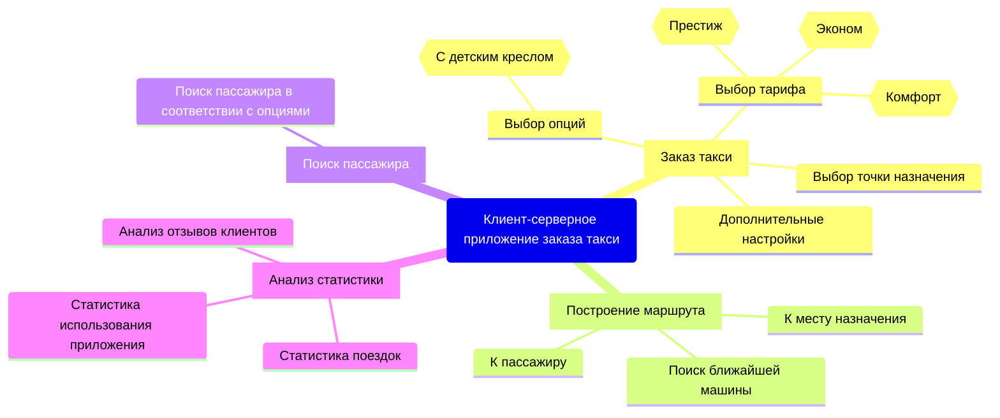
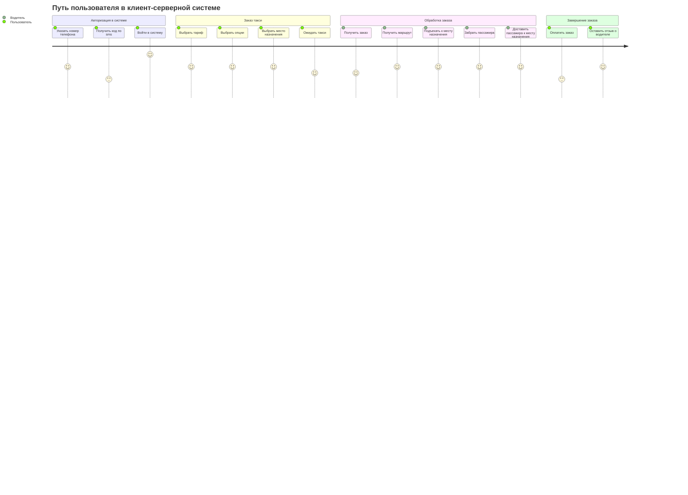
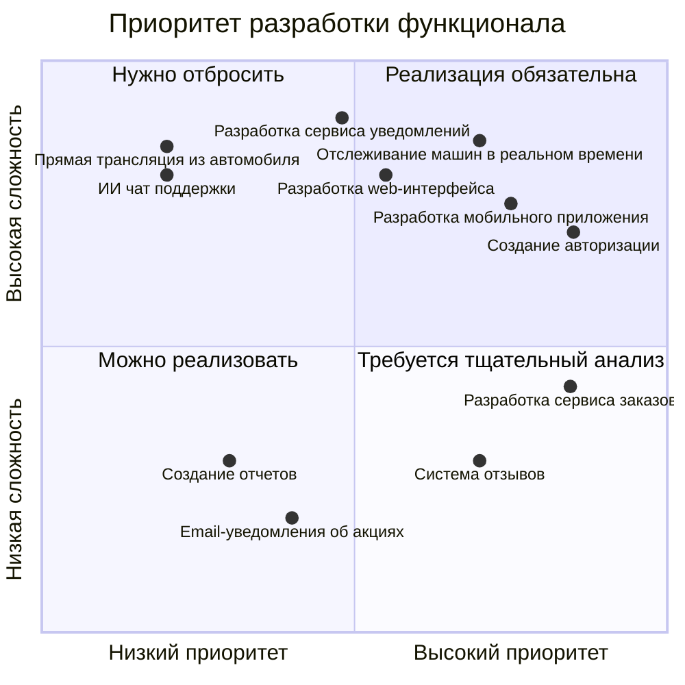
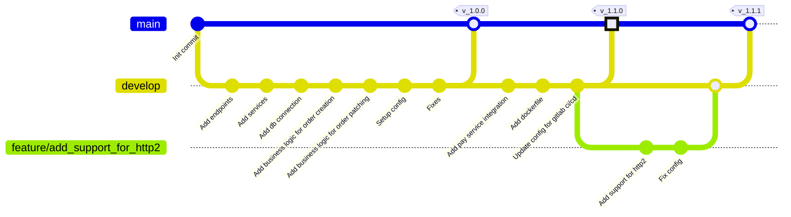

### Диаграмма структуры функциональных возможностей
Диаграмма описывает возможное применение проектируемого приложения: клиент-серверной системы для заказа такси.
Основными пользователями приложения являются: пассажиры (клиенты сервиса), водители и менеджеры, собирающие статистику.

### Диаграмма пути пользователя в системе
Диаграмма описывает взаимодействие пользователей с системой во время оформления и выполнения заказа.
Пользоваьель - Человек, заказывающий такси через приложение.
Водитель - осуществляющий заказ водитель.

### Квадрант-граф
Диаграмма описывает, какие задачи нужно выполнить в рамках реализации MVP приложения, а также их приоритет. Все задачи распределены по диаграмме в зависимости от их приоритета и сложности.
Hello world!

### Граф коммитов
На диаграмме приведен возможный граф коммитов во время разработки сервиса.
Мажорные релизы помечены квадратом.
